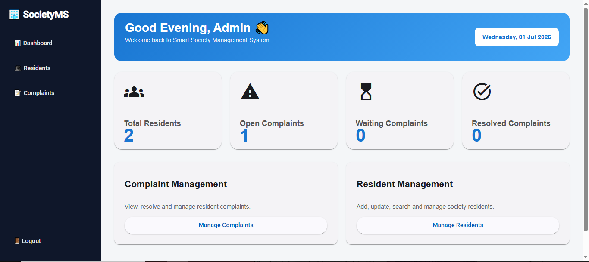
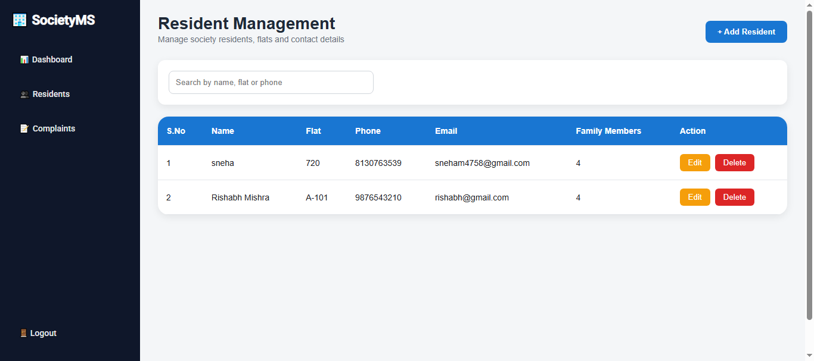
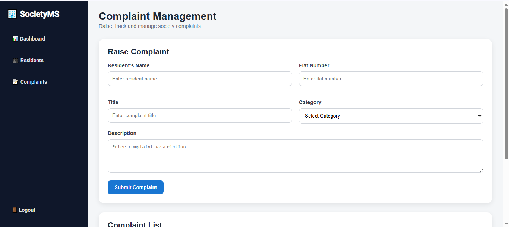
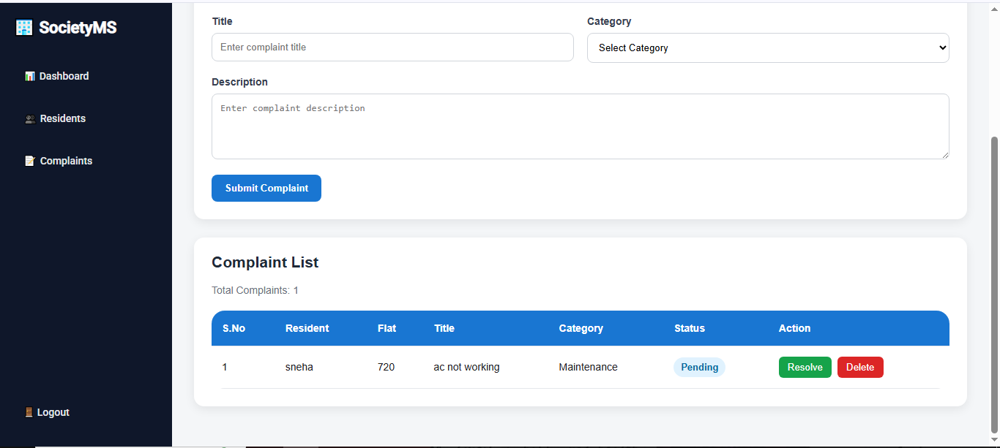

# Smart Society Management System

A full-stack Society Management System built using Angular, Node.js, Express.js, and MySQL.  
The project helps manage residents, complaints, and society operations through a clean dashboard-based interface.

## Screenshots
### Login page


### Dashboard


### Resident Management

### Complaint Management




## Features

- Admin login page
- Dashboard with live statistics from MySQL
- Complaint management
  - Add complaints
  - View complaints
  - Mark complaints as resolved
  - Delete complaints
- Resident management
  - Add residents
  - View residents
  - Edit residents
  - Delete residents with confirmation
  - Search residents
- Responsive Angular UI
- Node.js + Express backend
- MVC backend architecture
- MySQL database integration
- Git and GitHub version control

## Tech Stack

### Frontend
- Angular
- TypeScript
- Angular Material
- HTML
- CSS

### Backend
- Node.js
- Express.js
- MVC Architecture

### Database
- MySQL

### Tools
- Git
- GitHub
- VS Code
- Thunder Client

## Live Demo

Frontend: Coming Soon

Backend API: Coming Soon

## Author

**Sneha Mishra**

GitHub: https://github.com/Sneha1939

## Project Structure

```text
society-management-system
│
├── backend
│   ├── controllers
│   ├── models
│   ├── routes
│   ├── db.js
│   └── server.js
│
├── src
│   ├── app
│   │   ├── complaints
│   │   ├── dashboard
│   │   ├── residents
│   │   ├── login
│   │   ├── layout
│   │   └── services
│
├── angular.json
├── package.json
└── README.md

